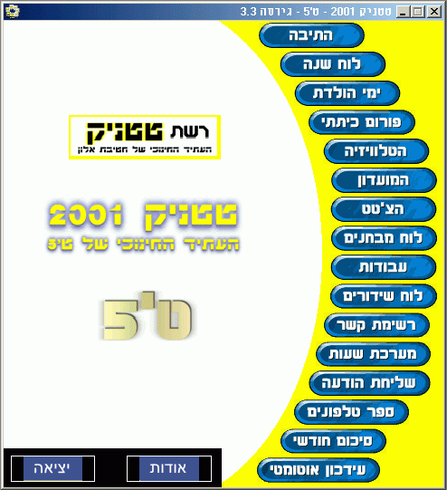

<div align="center">

## The Best Homeclass App in ISRAEL\!


</div>

### Description

To cheer up developers to create thier own HomeClass application.
 
### More Info
 


<span>             |<span>
---                |---
**Submitted On**   |
**By**             |[Sagi Klein](https://github.com/Planet-Source-Code/PSCIndex/blob/master/ByAuthor/sagi-klein.md)
**Level**          |Intermediate
**User Rating**    |3.0 (12 globes from 4 users)
**Compatibility**  |VB 6\.0
**Category**       |[Complete Applications](https://github.com/Planet-Source-Code/PSCIndex/blob/master/ByCategory/complete-applications__1-27.md)
**World**          |[Visual Basic](https://github.com/Planet-Source-Code/PSCIndex/blob/master/ByWorld/visual-basic.md)
**Archive File**   |[](https://github.com/Planet-Source-Code/sagi-klein-the-best-homeclass-app-in-israel__1-13879/archive/master.zip)


### Source Code

```
This "TETNICK" Application is a homeclass program for the pupils to use it for a specific school.
This Program was created by me , Sagi Klein , from Tet5 ,Alon Juniour High , Raanana , Israel.
My Homeclass app is packed with great features , offline and online.
The program was created in VB6 but the code will be transferd to VB7 (VB.NET) as soon as Microsoft will realese the FINAL version cause Microsoft don't allow publishing EXE's that has been Compiled on the BETA version.
The program has been made for 40 pupils class but Had over 200 downloads! (and more to come...)
TetNick prv. Name was "Tikshurit" , in english You might call it "Communcationer" but Tikshurit And another competitor (the only one) in the same School that was called Pitput-TET (In english: Babbler) has merged to Tikshurit , so Tikshurit And Pitput-TET became "TETNICK!".
The Program is in Hebrew but will be in english during FEBUARY 2001!.
The TETNCIK is totally free, so you can download It from www.TETNICK.com and take it as example.
Cause from now , I Proud to Annouce the ....
"Create your own HomeClass Application!"
Let's build a world full of TETNick's!!!
For every single education system in the world!
Just don't forget the SAGI KLEIN has started it.
(ISRAEL!)
```

